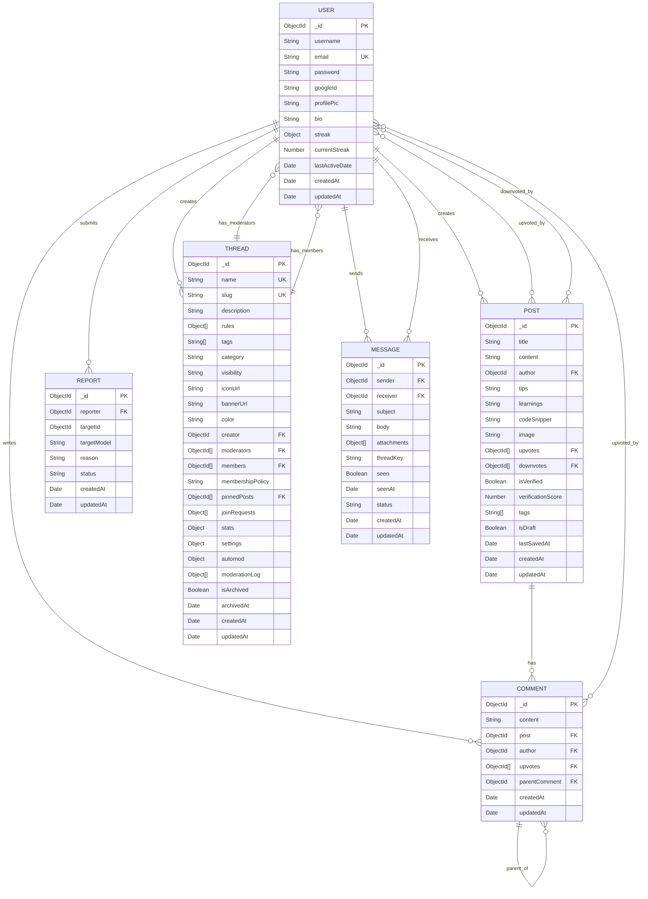

# LinkRead - MERN Stack Blogging Platform

A full-featured blogging and reading platform built with the MERN stack, enabling users to create, share, and engage with blog posts in a modern, responsive interface.

## Table of Contents

- [Project Overview](#project-overview)
- [Features](#features)
- [Tech Stack](#tech-stack)
- [Project Architecture & Workflow](#project-architecture--workflow)
- [ER Diagram](#er-diagram)
- [Folder Structure](#folder-structure)
- [Setup & Installation](#setup--installation)
  - [Prerequisites](#prerequisites)
  - [Clone the Repository](#clone-the-repository)
  - [Backend Setup](#backend-setup)
  - [Frontend Setup](#frontend-setup)
  - [Running the Application](#running-the-application)
- [Environment Variables](#environment-variables)
- [Backend Description](#backend-description)
- [Frontend Description](#frontend-description)
- [Database Management](#database-management)
- [Test Credentials](#test-credentials)
- [Team Members & Responsibilities](#team-members--responsibilities)
- [Future Scope](#future-scope)
- [License](#license)

## Project Overview

LinkRead is a comprehensive blogging platform designed to solve the problem of fragmented content sharing and engagement. It provides a centralized space where users can:

- **Create and publish** rich-text blog posts with images, code snippets, and formatted content
- **Read and discover** quality content from other users through an intuitive home feed
- **Engage with content** through upvotes, downvotes, and threaded comments
- **Manage their profile** with personalized user pages showing all published posts

Built using the MERN stack (MongoDB, Express.js, React.js, Node.js), LinkRead combines modern web technologies to deliver a fast, scalable, and user-friendly blogging experience.

## Features

- **User Authentication**
  - Secure registration and login system with JWT-based authentication
  - Password encryption using bcrypt
  - Protected routes for authenticated users only
  - Persistent login sessions

- **Blog Post Management**
  - Create blog posts with rich text editor (Quill)
  - Edit and delete your own posts
  - Add images, code snippets, tips, and learnings to posts
  - Tag-based categorization
  - Draft saving functionality

- **Content Discovery**
  - Home page with all published posts
  - Search functionality across titles, content, and tags
  - View individual posts with full content display
  - Upvote/downvote system for posts
  - Verification scoring system

- **User Profiles**
  - Personalized profile pages
  - Display user information (name, email, bio, profile picture)
  - Show total post count
  - List all posts by the user
  - Edit profile information

- **Engagement Features**
  - Threaded comment system on posts
  - Upvote/downvote on comments
  - Report inappropriate content (posts and comments)
  - User streak tracking for consistent engagement

- **Community Features**
  - Thread/community creation and management
  - Moderator roles and permissions
  - Community rules and moderation logs
  - Direct messaging between users

## Tech Stack

### Frontend
- **React.js** (v19.1.1) - UI library for building interactive interfaces
- **React Router DOM** (v7.9.4) - Client-side routing and navigation
- **Vite** (v7.1.7) - Fast build tool and development server
- **Axios** (v1.13.1) - HTTP client for API requests
- **React Quill** - Rich text editor for blog content
- **React Icons** - Icon library for UI elements
- **CSS** - Custom styling with modern CSS features

### Backend
- **Node.js** - JavaScript runtime environment
- **Express.js** (v5.1.0) - Web application framework
- **MongoDB** - NoSQL database for data storage
- **Mongoose** (v8.7.1) - MongoDB object modeling (ODM)
- **JWT** (jsonwebtoken v9.0.2) - Token-based authentication
- **bcryptjs** (v3.0.2) - Password hashing and encryption
- **CORS** - Cross-origin resource sharing middleware
- **Multer** - File upload handling
- **Validator** - Data validation library

### Tools & Others
- **dotenv** - Environment variable management
- **Slugify** - URL-friendly string generation
- **Google Generative AI** - AI integration capabilities
- **ESLint** - Code linting and quality checks
- **Git** - Version control

## Project Architecture & Workflow

### High-Level Architecture

LinkRead follows a classic three-tier MERN architecture:

1. **Client Layer (React Frontend)**
   - Handles user interface and interactions
   - Manages application state and routing
   - Sends HTTP requests to the backend API

2. **Server Layer (Express Backend)**
   - Processes API requests from the frontend
   - Implements business logic and validation
   - Manages authentication and authorization
   - Interacts with the database

3. **Database Layer (MongoDB)**
   - Stores all application data (users, posts, comments, etc.)
   - Handles data persistence and retrieval
   - Manages relationships between entities

### Request Flow Examples

#### User Registration/Login Flow
1. User fills out registration/login form in React frontend
2. Frontend sends POST request to `/api/auth/register` or `/api/auth/login`
3. Backend validates input data using validator library
4. For registration: Password is hashed with bcrypt, user document is created in MongoDB
5. For login: Password is compared with stored hash
6. Backend generates JWT token and sends it back to frontend
7. Frontend stores token in localStorage
8. Token is included in subsequent requests via Authorization header

#### Creating a Blog Post Flow
1. Authenticated user writes post content using Quill editor
2. Frontend sends POST request to `/api/posts` with post data and JWT token
3. Backend auth middleware verifies JWT token
4. Backend validates post data (title, content, etc.)
5. New Post document is created in MongoDB with author reference to User
6. Backend returns created post data to frontend
7. Frontend redirects user to the new post page or home page

#### Fetching and Displaying Posts Flow
1. User navigates to home page
2. Frontend sends GET request to `/api/posts`
3. Backend queries MongoDB for all published posts (isDraft: false)
4. Posts are populated with author information
5. Backend returns array of post objects
6. Frontend renders posts in a grid/list layout
7. User can click on a post to view full details

#### Upvoting a Post Flow
1. User clicks upvote button on a post
2. Frontend sends PUT request to `/api/posts/:id/upvote` with JWT token
3. Backend verifies authentication
4. Backend checks if user already upvoted/downvoted
5. User ID is added to/removed from upvotes array in Post document
6. Updated post is returned to frontend
7. Frontend updates UI to reflect new upvote count

## ER Diagram

The following Entity-Relationship diagram illustrates the database schema and relationships between collections:



### Entity Relationships Explained

- **USER to POST**: One-to-Many - A user can create multiple posts, but each post has one author
- **USER to COMMENT**: One-to-Many - A user can write multiple comments
- **POST to COMMENT**: One-to-Many - A post can have multiple comments
- **COMMENT to COMMENT**: Self-referencing - Comments can be replies to other comments (threaded)
- **POST/COMMENT to USER (upvotes/downvotes)**: Many-to-Many - Multiple users can upvote/downvote posts and comments
- **USER to THREAD**: One-to-Many - A user can create multiple threads/communities
- **THREAD to USER (moderators/members)**: Many-to-Many - Threads have multiple moderators and members
- **USER to MESSAGE**: One-to-Many - Users can send and receive multiple messages
- **USER to REPORT**: One-to-Many - Users can submit multiple reports

## Folder Structure

```
LinkRead/
├── backend/
│   ├── config/
│   │   └── db.js                 # MongoDB connection configuration
│   ├── controllers/
│   │   ├── authController.js     # Authentication logic (login, register)
│   │   ├── postController.js     # Post CRUD operations
│   │   ├── commentController.js  # Comment operations
│   │   ├── userController.js     # User profile management
│   │   ├── reportController.js   # Content reporting
│   │   ├── threadController.js   # Community/thread management
│   │   ├── messageController.js  # Direct messaging
│   │   └── aiController.js       # AI integration features
│   ├── middleware/
│   │   ├── auth.js               # JWT authentication middleware
│   │   ├── errorHandler.js       # Global error handling
│   │   └── upload.js             # File upload middleware (Multer)
│   ├── models/
│   │   ├── User.js               # User schema
│   │   ├── Post.js               # Post schema
│   │   ├── Comment.js            # Comment schema
│   │   ├── Thread.js             # Thread/community schema
│   │   ├── Report.js             # Report schema
│   │   └── Message.js            # Message schema
│   ├── routes/
│   │   ├── authRoutes.js         # Authentication endpoints
│   │   ├── postRoutes.js         # Post endpoints
│   │   ├── commentRoutes.js      # Comment endpoints
│   │   ├── userRoutes.js         # User endpoints
│   │   ├── reportRoutes.js       # Report endpoints
│   │   ├── threadRoutes.js       # Thread endpoints
│   │   ├── messageRoutes.js      # Message endpoints
│   │   └── aiRoutes.js           # AI endpoints
│   ├── utils/
│   │   ├── seedMockData.js       # Database seeding utility
│   │   ├── cleanupPosts.js       # Data cleanup utility
│   │   └── aiService.js          # AI service integration
│   ├── .env                      # Environment variables (not in git)
│   ├── server.js                 # Express server entry point
│   └── package.json              # Backend dependencies
│
├── frontend/
│   ├── src/
│   │   ├── components/
│   │   │   └── Navbar.jsx        # Navigation bar component
│   │   ├── pages/
│   │   │   ├── Home.jsx          # Home page with post feed
│   │   │   ├── LogIn.jsx         # Login page
│   │   │   ├── Register.jsx      # Registration page
│   │   │   ├── CreatePost.jsx    # Create/edit post page
│   │   │   ├── PostDetails.jsx   # Individual post view
│   │   │   └── Profile.jsx       # User profile page
│   │   ├── styles/
│   │   │   ├── Home.css          # Home page styles
│   │   │   ├── Login.css         # Login page styles
│   │   │   ├── Register.css      # Register page styles
│   │   │   ├── CreatePost.css    # Create post page styles
│   │   │   ├── PostDetails.css   # Post details page styles
│   │   │   ├── Profile.css       # Profile page styles
│   │   │   └── Navbar.css        # Navbar styles
│   │   ├── App.jsx               # Main app component with routing
│   │   ├── main.jsx              # React entry point
│   │   ├── index.css             # Global styles
│   │   └── api.js                # API configuration
│   ├── public/                   # Static assets
│   ├── package.json              # Frontend dependencies
│   └── vite.config.js            # Vite configuration
│
├── .gitignore
├── LICENSE
└── README.md                     # This file
```

### Folder Explanations

- **backend/config**: Database connection and configuration files
- **backend/controllers**: Business logic for handling requests
- **backend/middleware**: Reusable middleware functions (auth, error handling, file uploads)
- **backend/models**: Mongoose schemas defining data structure
- **backend/routes**: API endpoint definitions
- **backend/utils**: Utility functions and helper scripts
- **frontend/src/components**: Reusable React components
- **frontend/src/pages**: Page-level components for different routes
- **frontend/src/styles**: CSS files for styling components and pages

## Setup & Installation

Follow these detailed steps to set up and run LinkRead on your local machine.

### Prerequisites

Before you begin, ensure you have the following installed:

- **Node.js** (v16 or higher) and **npm** (v8 or higher)
  - Download from [nodejs.org](https://nodejs.org/)
  - Verify installation: `node --version` and `npm --version`

- **MongoDB** connection string
  - Option 1: Use [MongoDB Atlas](https://www.mongodb.com/cloud/atlas) (free cloud database)
  - Option 2: Install MongoDB locally from [mongodb.com](https://www.mongodb.com/try/download/community)

- **Git** for cloning the repository
  - Download from [git-scm.com](https://git-scm.com/)

### Clone the Repository

```bash
# Clone the repository
git clone https://github.com/yourusername/LinkRead.git

# Navigate to the project directory
cd LinkRead
```

### Backend Setup

1. **Navigate to the backend folder:**
   ```bash
   cd backend
   ```

2. **Install backend dependencies:**
   ```bash
   npm install
   ```

3. **Create a `.env` file** in the `backend` directory:
   ```bash
   touch .env
   ```

4. **Add environment variables** to the `.env` file (see [Environment Variables](#environment-variables) section below for details):
   ```env
   PORT=8001
   MONGODB_URI=your_mongodb_connection_string_here
   JWT_SECRET=your_jwt_secret_here
   CLIENT_URL=http://localhost:5173
   ```

5. **Start the backend server:**
   ```bash
   # Development mode
   npm run dev
   
   # OR production mode
   npm start
   ```

   You should see: `Server running on port 8001` and `MongoDB Connected`

### Frontend Setup

1. **Open a new terminal** and navigate to the frontend folder:
   ```bash
   cd frontend
   ```

2. **Install frontend dependencies:**
   ```bash
   npm install
   ```

3. **(Optional) Configure API base URL:**
   - The API base URL is configured in `src/api.js`
   - Default is `http://localhost:8001/api`
   - Modify if your backend runs on a different port

4. **Start the frontend development server:**
   ```bash
   npm run dev
   ```

   You should see: `Local: http://localhost:5173/`

### Running the Application

1. **Ensure both servers are running:**
   - Backend: `http://localhost:8001`
   - Frontend: `http://localhost:5173`

2. **Open your browser** and navigate to:
   ```
   http://localhost:5173
   ```

3. **You can now:**
   - Register a new account
   - Log in with existing credentials (see [Test Credentials](#test-credentials))
   - Create and publish blog posts
   - Browse posts on the home page
   - View user profiles

### Important Notes

- The backend must be running before the frontend can fetch data
- Make sure the ports (8001 for backend, 5173 for frontend) are not in use by other applications
- CORS is configured to allow requests from `http://localhost:*` origins
- If you change the backend port, update the API URL in `frontend/src/api.js`

## Environment Variables

### Backend Environment Variables

Create a `.env` file in the `backend` directory with the following variables:

```env
PORT=8001
MONGODB_URI=your_mongodb_connection_string_here
JWT_SECRET=your_jwt_secret_here
CLIENT_URL=http://localhost:5173
```

#### Variable Explanations

- **PORT** (default: 8001)
  - The port number on which the Express server will run
  - Can be changed to any available port (e.g., 3000, 5000, 8000)

- **MONGODB_URI** (required)
  - Your MongoDB connection string
  - **For MongoDB Atlas**: `mongodb+srv://<username>:<password>@cluster.mongodb.net/linkread?retryWrites=true&w=majority`
  - **For local MongoDB**: `mongodb://localhost:27017/linkread`
  - Replace `<username>` and `<password>` with your MongoDB credentials
  - The database name (`linkread`) can be customized

- **JWT_SECRET** (required)
  - A secret key used to sign and verify JWT tokens
  - Should be a long, random string for security
  - Example: `your_super_secret_jwt_key_change_this_in_production`
  - **Important**: Never commit this to version control; keep it secure

- **CLIENT_URL** (default: http://localhost:5173)
  - The URL of your frontend application
  - Used for CORS configuration
  - Change to your production frontend URL when deploying

### Frontend Environment Variables (Optional)

If you need to configure the API URL differently, create a `.env` file in the `frontend` directory:

```env
VITE_API_URL=http://localhost:8001/api
```

#### Variable Explanations

- **VITE_API_URL** (optional)
  - The base URL for backend API requests
  - Currently hardcoded in `src/api.js` but can be made configurable
  - Must start with `VITE_` prefix to be accessible in Vite applications

## Backend Description

### Framework & Architecture

The backend is built with **Express.js**, a minimal and flexible Node.js web application framework. It follows the **MVC (Model-View-Controller)** pattern with a RESTful API architecture:

- **Models**: Define data schemas using Mongoose ODM
- **Controllers**: Handle business logic and request processing
- **Routes**: Define API endpoints and map them to controllers

### Key Modules

#### Authentication & Security
- **JWT (JSON Web Tokens)**: Stateless authentication mechanism
  - Tokens are generated upon login and stored in client localStorage
  - Protected routes verify tokens via `auth` middleware
  - Tokens include user ID and expiration time

- **bcryptjs**: Password hashing and comparison
  - Passwords are hashed with salt rounds before storage
  - Never stores plain-text passwords
  - Secure password verification during login

#### Core Features

1. **User Management** (`userController.js`)
   - Get user profile information
   - Update user profile (username, bio, profile picture)
   - Track user statistics (post count, streak)

2. **Post Management** (`postController.js`)
   - Create new posts with rich content
   - Update existing posts (author-only)
   - Delete posts (author-only)
   - Get all posts with pagination and filtering
   - Search posts by title, content, or tags
   - Upvote/downvote functionality
   - Draft saving and publishing

3. **Comment System** (`commentController.js`)
   - Create comments on posts
   - Threaded/nested comments (replies)
   - Upvote comments
   - Delete comments (author or post owner)

4. **Reporting System** (`reportController.js`)
   - Report inappropriate posts or comments
   - Track report status (Pending, Reviewed, Resolved)
   - Admin moderation capabilities

5. **Community Features** (`threadController.js`)
   - Create and manage threads/communities
   - Moderator permissions
   - Member management
   - Community rules and settings

6. **Messaging** (`messageController.js`)
   - Direct messaging between users
   - Message threads
   - Read receipts

### API Endpoints (Summary)

- **Auth**: `/api/auth/register`, `/api/auth/login`
- **Posts**: `/api/posts` (GET, POST), `/api/posts/:id` (GET, PUT, DELETE)
- **Comments**: `/api/comments` (POST), `/api/comments/:id` (DELETE)
- **Users**: `/api/users/profile`, `/api/users/:id`
- **Reports**: `/api/reports` (POST, GET)

### Error Handling

- **Global Error Handler**: Centralized error handling middleware (`errorHandler.js`)
- **Validation Errors**: Mongoose validation errors are caught and formatted
- **Authentication Errors**: 401 Unauthorized for invalid/missing tokens
- **Authorization Errors**: 403 Forbidden for insufficient permissions
- **Not Found Errors**: 404 for non-existent resources
- **Server Errors**: 500 for unexpected server issues

All errors return consistent JSON responses:
```json
{
  "success": false,
  "message": "Error description",
  "error": "Detailed error info (in development)"
}
```

## Frontend Description

### Framework & Architecture

The frontend is built with **React.js** using **Vite** as the build tool for fast development and optimized production builds. It follows a component-based architecture with:

- **Functional Components**: Modern React with hooks
- **React Router**: Client-side routing for single-page application experience
- **Axios**: HTTP client for API communication
- **Context/State Management**: Component-level state with hooks

### Routing

The application uses **React Router DOM** for navigation:

```javascript
Routes:
- / → Home (public)
- /login → Login (public)
- /register → Register (public)
- /create-post → CreatePost (protected)
- /edit-post/:id → CreatePost (protected)
- /post/:id → PostDetails (public)
- /profile/:userId → Profile (public)
```

Protected routes check for authentication token and redirect to login if not authenticated.

### Main Pages

1. **Home** (`Home.jsx`)
   - Displays all published blog posts in a grid layout
   - Search functionality to filter posts
   - Post cards show title, excerpt, author, and engagement metrics
   - Click on a post to view full details

2. **Login/Register** (`LogIn.jsx`, `Register.jsx`)
   - Clean, centered glass-morphism UI design
   - Form validation and error handling
   - Automatic redirect to home upon successful authentication
   - Stores JWT token in localStorage

3. **Create/Edit Post** (`CreatePost.jsx`)
   - Rich text editor (React Quill) for content creation
   - Fields for title, content, tips, learnings, code snippets
   - Tag input for categorization
   - Image upload support
   - Draft saving functionality
   - Edit mode pre-fills existing post data

4. **Post Details** (`PostDetails.jsx`)
   - Full post content with HTML rendering
   - Author information and post metadata
   - Upvote/downvote buttons
   - Delete button (visible only to post author)
   - Comment section (if implemented)

5. **Profile** (`Profile.jsx`)
   - User information display (name, email, bio, profile picture)
   - Total post count
   - Grid of all posts by the user
   - Edit profile functionality (for own profile)

### UI/UX Features

- **Responsive Design**: Works seamlessly on desktop, tablet, and mobile devices
- **Modern Aesthetics**: Glass-morphism effects, smooth animations, vibrant gradients
- **Dark Theme**: Consistent dark color scheme throughout the application
- **Loading States**: Visual feedback during API requests
- **Error Handling**: User-friendly error messages
- **Active Route Highlighting**: Navbar shows current page

### API Communication

The frontend communicates with the backend via Axios:

```javascript
// API base configuration (src/api.js)
const API_URL = 'http://localhost:8001/api';

// Example request with authentication
axios.get(`${API_URL}/posts`, {
  headers: {
    Authorization: `Bearer ${token}`
  }
});
```

All authenticated requests include the JWT token in the Authorization header.

## Database Management

### Database Technology

LinkRead uses **MongoDB**, a NoSQL document database, with **Mongoose** as the Object Data Modeling (ODM) library.

### Collections

The database consists of six main collections:

1. **users** - User accounts and profiles
2. **posts** - Blog posts and articles
3. **comments** - Comments on posts (with threading support)
4. **threads** - Communities/discussion threads
5. **reports** - Content moderation reports
6. **messages** - Direct messages between users

### Relationships

MongoDB doesn't enforce relationships like SQL databases, but Mongoose provides reference-based relationships:

- **References (ObjectId)**: Posts reference Users via `author` field
- **Population**: Mongoose `.populate()` method fetches referenced documents
- **Arrays of References**: Posts have arrays of User IDs for upvotes/downvotes
- **Embedded Documents**: Threads have embedded subdocuments for rules and moderation logs

### Indexes

Performance-optimized indexes are created for:

- **User email**: Unique index for fast login lookups
- **Post search**: Text index on title, content, and tags for full-text search
- **Thread slug**: Unique index for URL-friendly thread names
- **Message threadKey**: Index for efficient message thread queries

### Unique Constraints

- **User email**: Must be unique across all users
- **Thread name**: Must be unique across all threads
- **Thread slug**: Must be unique for URL routing

### Data Validation

Mongoose schemas enforce data validation:

- **Required fields**: username, email, password (User); title, content, author (Post)
- **Type validation**: String, Number, Boolean, Date, ObjectId
- **String constraints**: minlength, maxlength, trim, lowercase
- **Enum validation**: Specific allowed values (e.g., report status, visibility)
- **Custom validation**: Email format, password strength (via validator library)

### Seeding & Initialization

The `utils/seedMockData.js` script can populate the database with sample data for development and testing purposes.

## Test Credentials

For quick testing and evaluation, you can use the following pre-configured account:

- **Email**: `test29@gmail.com`
- **Password**: `290805`

This test account has existing posts and profile data for demonstration purposes.

## Team Members & Responsibilities

LinkRead was developed by a team of four dedicated members, each contributing their expertise to different aspects of the project:

### Ipshita Patel
- Overall project coordination and documentation
- Frontend development for core pages (Home, PostDetails, CreatePost, Profile)
- UI/UX design decisions and component structure
- Integration between frontend and backend APIs
- README and project presentation structure
- Testing and quality assurance

### Kumar Manak
- Backend development (Express routes and controllers)
- User authentication and authorization logic
- Post CRUD APIs (create, read, update, delete posts)
- Middleware implementation (auth middleware, error handling)
- Environment configuration and server setup
- API endpoint design and implementation

### Mayank Choudhary
- Database design and schema modeling (MongoDB/Mongoose)
- Entity-Relationship mapping and model relationships
- Query optimization and data validation
- Implementation of comments, likes, and engagement features
- Database indexing and performance tuning
- Support in backend testing and debugging

### Rohit Dahiya
- Frontend state management and API integration
- Navbar component and authentication pages (Login/Register)
- Routing flows and protected route implementation
- Profile page data binding (user details and post counts)
- Testing frontend flows and fixing UI bugs
- Assistance in deployment steps and documentation

## Future Scope

LinkRead has significant potential for expansion and enhancement. Planned future improvements include:

### Features
- **Advanced Search & Filters**: Filter posts by date, popularity, tags, author
- **Pagination**: Implement infinite scroll or page-based navigation for better performance
- **Rich Media Support**: Video embeds, audio files, image galleries
- **Social Features**: Follow users, personalized feed, notifications
- **Bookmarks/Favorites**: Save posts for later reading
- **Post Analytics**: View counts, engagement metrics, trending posts
- **Email Notifications**: New comments, mentions, weekly digest
- **Mobile App**: React Native version for iOS and Android

### Technical Improvements
- **Real-time Updates**: WebSocket integration for live comments and notifications
- **Image Optimization**: Cloudinary or S3 integration for image hosting
- **Caching**: Redis for session management and frequently accessed data
- **Testing**: Unit tests (Jest), integration tests, E2E tests (Cypress)
- **CI/CD Pipeline**: Automated testing and deployment
- **Performance Monitoring**: Error tracking (Sentry), analytics (Google Analytics)
- **SEO Optimization**: Server-side rendering, meta tags, sitemaps

### Community & Moderation
- **Enhanced Moderation Tools**: Automated spam detection, content filtering
- **User Reputation System**: Karma points, badges, achievements
- **Thread/Community Features**: Fully implement thread functionality
- **Admin Dashboard**: Comprehensive admin panel for platform management

## License

This project is licensed under the MIT License - see the [LICENSE](LICENSE) file for details.

---

**Built with ❤️ by the LinkRead Team**

For questions or support, please open an issue on GitHub or contact the development team.